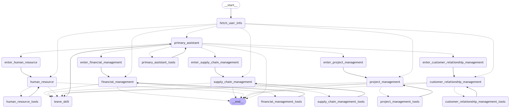

Check out the configuration reference at https://huggingface.co/docs/hub/spaces-config-reference

**This is an Automated ERP Management System**

you can clone the repository from github from the link: https://github.com/sArwar-sHafee/ERP-system.git

Using ssh: `git clone git@github.com:sArwar-sHafee/ERP-system.git`

`cd ERP-system`

`pip install -r requirements.txt`

`export OPENAI_API_KEY=<your_api_key>`

now run `python app.py`

this is provide a local host link to interact with the gradio interface.

enter into the link provided by gradio. Generally the link will be: `http://127.0.0.1:7860/`

Or you can also directly chat into the huggingface space from the link:

`https://huggingface.co/spaces/SarwarShafee/ERP-system`

---

## Structure of the project

```
ERP-system/
    ERP-system/
        app.py
        llm_runner.py
        erp_core/
            ...
            runnable/
                ...
            Tools/
            	...
            tool_binder/
                ...
            node_builder/
            	...

```

The `llm_runner.py` file runs the llm only. And user will be able to chat with the system via terminal by running this file.


The `app.py` file runs the system in gradio interface. Here all the NLP components are joined together. 

---


# About the Project:

The project is a system for maintaining an ERP system. A combination of few agents 

There are five departments: Customer Relationship Management, Financial Management Human Resources, Project Management, and Supply Chain Management. Each department is managed by a dedicated AI agent.

Right now the financial management department can do 2 tasks. 
- registering a purchase request
- Provide the report on how many requests were being purchased in together.

All 5 agents are delegated to different tools. The tool will be called for solving different tasks. 

The system takes audio as input. The asr model that is used here is whisper-1.

Then the audio goes to the llm portion. OpenAI gpt-4-omni is being used in the backend of the llm.

The response from the LLM part goes to the tts which is also using openai api. The tts model generates the audio and provides to the gradio inteface. Gradio interface plays the sound. 

No finetune was necessay here. The prompt for different agent are working to operate the whole system. 

# How the LLM Agents work:

The the agentic system used here is langgraph agentic system. 

1st we need to define all nodes and edges. Then each node was assigned with the proper tool they need. Here each node are working as an AI agent. There is a tool CompleteorEscelate which was assigned to each node. If any node think that the user query does not goes with it, then it will call that tool to deligate the task to another node or agent.

There is a stating node called Primary Assistant. It is handling all the other agents. And making decision which agent should handle the user task now.

To whole graph of the agent system is shown in the output_image.png file.


